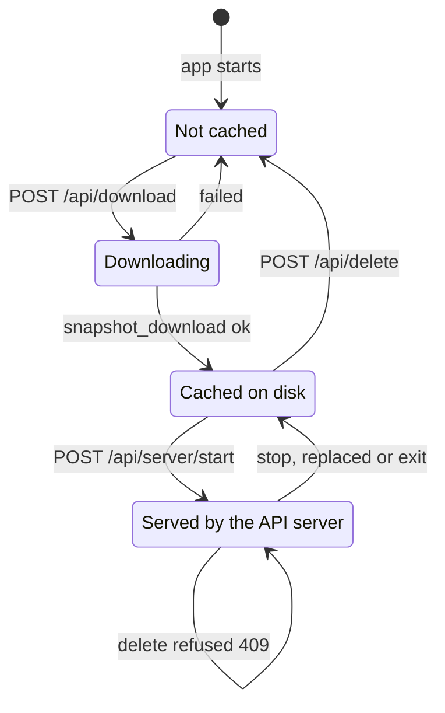

# Model lifecycle

Every state a model can be in (2.0.13 source, unreleased).

```mermaid
stateDiagram-v2
    [*] --> NotCached: app starts
    NotCached --> Downloading: POST /api/download
    Downloading --> Cached: snapshot_download ok
    Downloading --> NotCached: failed
    Cached --> Served: POST /api/server/start
    Served --> Cached: stop, replaced or exit
    Served --> Served: POST /api/chat
    Cached --> NotCached: POST /api/delete
    Served --> Served: delete refused 409

    state "Not cached" as NotCached
    state "Downloading" as Downloading
    state "Cached on disk" as Cached
    state "Served by the API server" as Served
```
